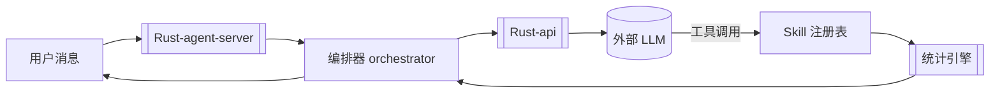

# LLM 集成

> 横切概念:AI 对话能力的接入。把用户自然语言 → 统计分析意图 → 调用[[统计引擎]] → 返回结果,全程由 LLM 驱动工具调用。

## 数据流

## 涉及模块

| 层 | Rust | TS |
|----|------|-----|
| 厂商客户端 | [[Rust-api]] `client.rs` `providers/` | [[TS-server]] `providers.ts` |
| 认证 | api `auth/`(OAuth PKCE) | server `providers.ts` |
| 流式 | api `sse.rs` | server `sse.ts` / `llm.ts` |
| 编排 | [[Rust-agent-core]] `orchestrator.rs` `skill/` | [[TS-server]] `state.ts` `mem-store.ts` |

## 配置
- Key 存明文 TOML:`%APPDATA%\stats-code\config.toml`(依赖 NTFS 权限)。
- 首次运行未配置 → 前端 [[Web-前端]] 的 `OnboardingCard` 遮罩,填 provider + Key + 测试保存。
- 运行中失败 → `ConnectionBanner` 横幅(重试/改 Key)。

## 相关
- [[Rust-api]] · [[Rust-agent-core]] · [[TS-server]] · [[Web-前端]]
- [[领域语言]]
