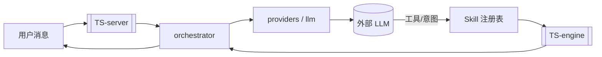

# LLM 集成

> 横切概念：AI 对话能力的接入。把用户自然语言 → 统计分析意图 → 调用 [[统计引擎]] → 返回结果。

## 数据流

## 涉及模块（TS only）

| 层 | 位置 |
|----|------|
| 厂商客户端 | [[TS-server]] `providers.ts` / LLM 相关模块 |
| 流式 SSE | [[TS-server]] `sse.ts` |
| 编排 / 会话 | [[TS-server]] orchestrator、session store、mem-store |
| Skill 执行 | [[TS-server]] skill registry + runner → engine 纯函数 |
| 前端 | [[Web-前端]] OnboardingCard、ConnectionBanner、useSseChat |

## 配置

- Key 存储：`%APPDATA%\stats-code\llm-config.json`（原子写入；损坏则备份为 `.corrupt-*`）
- 依赖 NTFS 用户权限，不使用 DPAPI
- 首次未配置 → 前端遮罩配置卡片
- 运行中失败 → 顶部横幅（重试 / 改 Key）

详见 `CONTEXT.md`「LLM 配置」。

## 相关

- [[TS-server]] · [[Web-前端]] · [[统计引擎]] · [[领域语言]]
