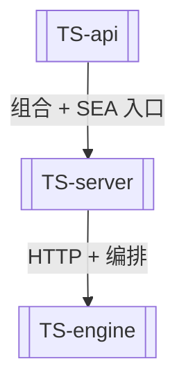

# TS 后端重写（已完成）

> **历史说明**：原 Rust 后端（`api` / `agent-core` / `agent-server` / `stats-code`）已于 2026-06 退役删除。当前唯一生产实现为 TypeScript（Node.js 22 LTS）。本文保留迁移期不变量，避免把「重写中」误读为现状。

## 核心不变量（仍然有效）

1. **数值可信**：算法输出对照 SAS/SPSS/教科书基线（`tests/parity`），在容差内通过。
2. **进程内计算**：不 spawn 外部统计运行时（[[ADR-0003-TS后端进程内算法]]）。
3. **三层包**：`api → server → engine`，无独立 core 包（[[ADR-0004-TS三层包结构]]）。
4. **Power 例外**：对齐 SAS PROC POWER（[[ADR-0005-Power家族对齐SAS]]）。
5. **前端契约**：HTTP/SSE 契约保持，[[Web-前端]] 对接 [[TS-server]]。

## 当前结构

## 测试体系

`tests/{unit,integration,property,parity}` —— 单元 + 集成 + 属性测试 + 数值对照。

## 相关

- [[TS-api]] · [[TS-server]] · [[TS-engine]]
- [[发展路线图]] · [[项目总览]]
