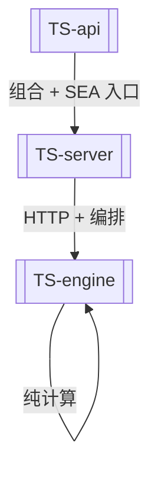

# TS 后端重写

> 把 Rust 后端(`api` / `agent-core` / `agent-server` / `stats-code`)契约保持地重写为 TypeScript(Node.js 22 LTS)。前端 [[Web-前端]] 不变。

## 核心不变量

**数值等价于 Rust 后端** —— TS 输出对照 Rust 行为基准 + 录制的 SAS/SPSS 基线,在容差内通过。唯一刻意例外:[[Parity与Sidecar]] 里的 Power 家族(见 [[ADR-0005-Power家族对齐SAS]])。

## 三层包结构

依赖方向(eslint 强制):**[[TS-api]] → [[TS-server]] → [[TS-engine]]**

> 注意:相比 Rust 的 4 个 crate,TS 版**砍掉了 core 包**(原 [[Rust-agent-core]] 对应),职责并入 [[TS-server]]。原因见 [[ADR-0004-TS三层包结构]]。

## 与 Rust 版的关键差异

| 维度 | Rust 版 | TS 版 | ADR |
|------|---------|-------|-----|
| 算法调用 | spawn 子进程 `stats-code --json` | **进程内纯函数** | [[ADR-0003-TS后端进程内算法]] |
| 包数量 | 4 crate | 3 包(无 core) | [[ADR-0004-TS三层包结构]] |
| Power 算法 | normal 近似 | 对齐 SAS PROC POWER | [[ADR-0005-Power家族对齐SAS]] |
| 产物 | `cargo build` exe | Node SEA 单文件 exe | [[ADR-0001-单文件exe分发]] |

## 测试体系

`tests/{unit,integration,property,parity}` —— 单元 + 集成 + 属性测试(fast-check)+ 数值对照(parity)。343+ 测试。

## 现状

Phase 0 脚手架完成,子模块按各 phase 逐步填充。详见 spec:`.kiro/specs/typescript-backend-rewrite/`。

## 相关
- [[TS-api]] · [[TS-server]] · [[TS-engine]]
- [[发展路线图]]
