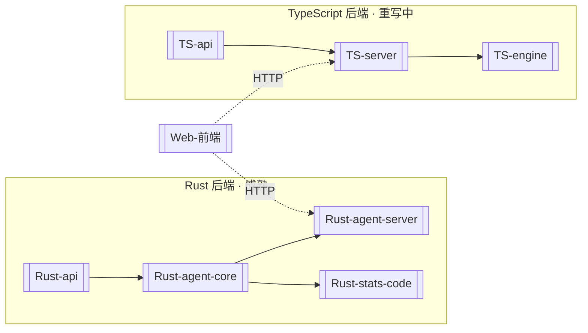

# 项目总览 (Stats Code)

> **一句话**:一个纯 Rust 的医学/流行病学统计分析工具,配 React 聊天式前端;目前正把后端从 Rust 重写为 TypeScript。

## 它是什么

用户在任意目录敲一条命令 `stats-code` 就会:启动本地 HTTP 后端(`127.0.0.1:8080`)+ 前端,自动开浏览器,提供一个 **AI 辅助的统计分析聊天界面**。上传数据 → 对话 → 跑统计算法(TableOne、生存分析、回归等)→ 出可审计的报告。

详见 [[领域语言]](源自 `CONTEXT.md`)。

## 两套后端(关键!)

项目现在有**两套并行的后端实现**,这是理解整个仓库的钥匙:

- **Rust 后端**(`crates/`):当前生产实现,~40000 行,成熟稳定。
- **TS 后端**(`ts-backend/`):契约保持的重写,进行中。见 [[TS后端重写]]。
- **前端**(`web/`):React 19 + Vite,两套后端共用,基本不变。

## 导航(MOC)

### Rust 后端 crates
- [[Rust-api]] —— LLM 厂商客户端 + OAuth + SSE 流式
- [[Rust-agent-core]] —— 领域逻辑:会话状态机、Skill、编排
- [[Rust-agent-server]] —— axum HTTP 服务,对外路由
- [[Rust-stats-code]] —— 统计引擎 + CLI(项目心脏)

### TypeScript 后端
- [[TS后端重写]] —— 重写总览与现状
- [[TS-api]] · [[TS-server]] · [[TS-engine]]

### 前端
- [[Web-前端]] —— React + Vite 聊天界面

### 横切概念
- [[统计引擎]] —— 所有统计算法的集合
- [[LLM集成]] —— AI 对话与厂商对接
- [[单命令启动器]] —— `stats-code` 一条命令的启动逻辑
- [[Parity与Sidecar]] —— TS↔Rust 数值等价 + 等价代码侧栏
- [[审计快照]] —— 可复现的分析审计

### 架构决策 (ADR)
- [[ADR-0001-单文件exe分发]]
- [[ADR-0002-接受sled未维护依赖]]
- [[ADR-0003-TS后端进程内算法]]
- [[ADR-0004-TS三层包结构]]
- [[ADR-0005-Power家族对齐SAS]]

### 进展与计划
- [[发展路线图]] —— T1~T6 阶段规划(源自 `implementation_plan.md`)
