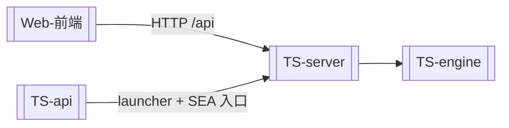

# 项目总览 (Stats Code)

> **一句话**：本地单机的医学/流行病学统计分析工具——TypeScript 后端 + React 聊天式前端；用户敲 `stats-code` 即可启动。

## 它是什么

用户在任意目录敲一条命令 `stats-code` 就会：启动本地 HTTP 后端（`127.0.0.1:8080`）+ 内嵌前端，自动开浏览器，提供 **AI 辅助的统计分析界面**。上传数据 → 对话/专业工作台 → 跑统计算法（TableOne、生存分析、回归等）→ 出可审计的报告与等价代码侧栏。

详见 [[领域语言]]（源自 `CONTEXT.md`）。

## 当前架构（唯一生产路径）

| 层 | 路径 | 职责 |
|----|------|------|
| 前端 | `web/` | React 19 + Vite，Simple / Pro 双模式 |
| 组合入口 | `ts-backend/packages/api` | launcher、SEA 二进制入口 |
| HTTP/编排 | `ts-backend/packages/server` | 会话、LLM、skill 执行、契约路由 |
| 统计引擎 | `ts-backend/packages/engine` | 17 个进程内算法 + math/sidecar/snapshot |

依赖方向（强制）：**api → server → engine**。

> 历史：原 Rust 4-crate workspace 已删除；Rust 时代 git 分支/标签已清理。迁移决策见 [[TS后端重写]] 与 ADR-0003/0004/0005。

## 导航 (MOC)

### TypeScript 后端
- [[TS后端重写]] —— 从 Rust 迁移的完成说明（历史 + 不变量）
- [[TS-api]] · [[TS-server]] · [[TS-engine]]

### 前端
- [[Web-前端]]

### 横切概念
- [[统计引擎]] —— 统计算法集合（以 engine 为准）
- [[LLM集成]] —— AI 对话与厂商对接
- [[单命令启动器]] —— `stats-code` 一条命令
- [[Parity与Sidecar]] —— 参考软件数值对照 + 等价代码侧栏
- [[审计快照]] —— 可复现分析导出

### 架构决策 (ADR)
- [[ADR-0001-单文件exe分发]]
- [[ADR-0003-TS后端进程内算法]]
- [[ADR-0004-TS三层包结构]]
- [[ADR-0005-Power家族对齐SAS]]

### 进展与计划
- [[发展路线图]]
